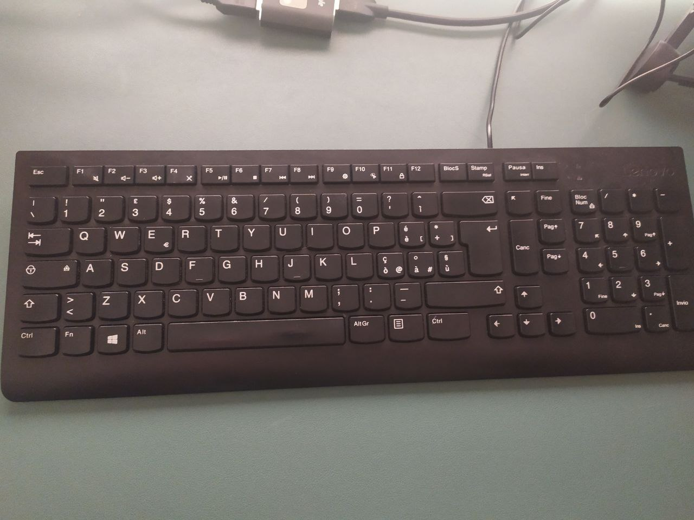

# Qwerty-macos-ita-layout

## Custom Layout for MacOS - ITA PC standard QWERTY Keyboard

If you keyboard look like this and you want to make it work with Mac OS follow instruction below.



## 1) Switch those commands


## 2) Install the keyboard layout system-wide

- ```cd /Library/Keyboard\ Layouts; sudo curl -O# https://raw.githubusercontent.com/GaetanoPiazzolla/qwerty-macos-ita-layout/master/QWERTY-ita.keylayout```
- Log out and log in again.
- Enable the new keyboard layout via System Preferences › Keyboard › Input Sources › Others (Altre) › QUERTY-ITA

---------------

Created using [Ukelele.app](http://scripts.sil.org/ukelele).
